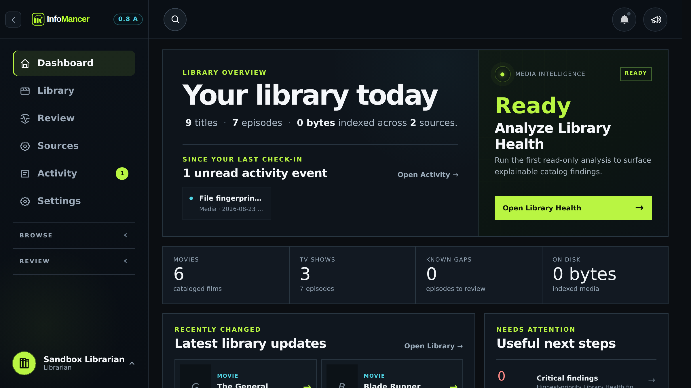
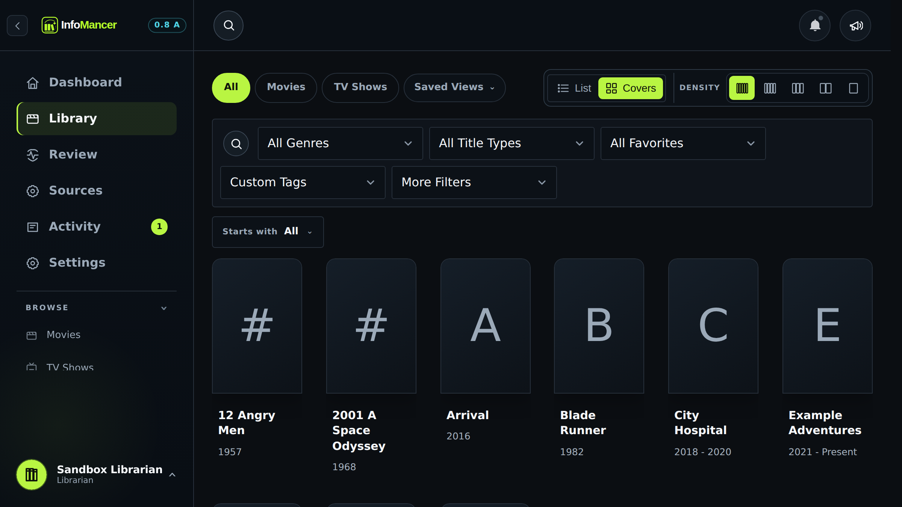
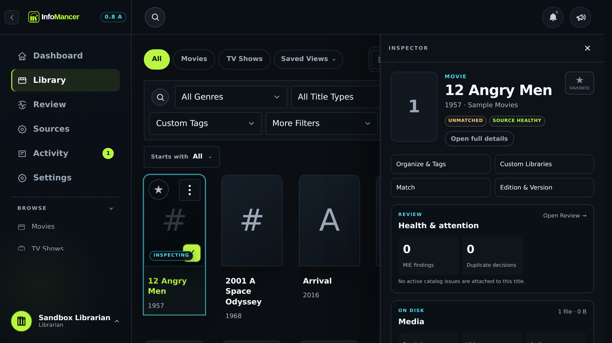
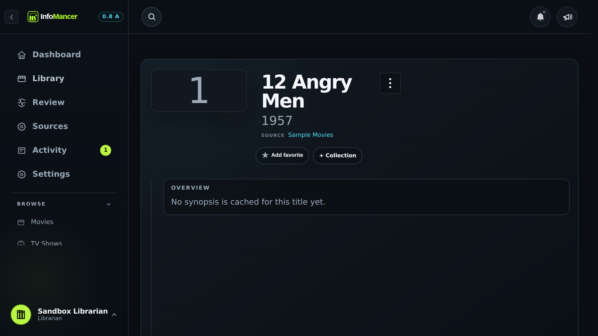
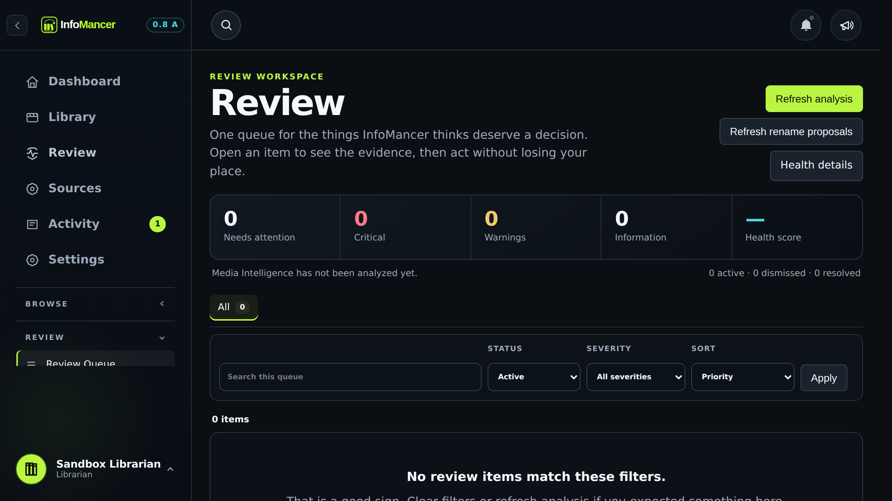

# InfoMancer

<p align="center"><strong>Your media library, understood.</strong></p>
<p align="center">Local-first cataloging, media intelligence, review, organization, and safe filesystem management for Movie and TV libraries.</p>
<p align="center"><strong>0.8 alpha</strong> · Windows · macOS · Linux · Docker</p>

InfoMancer is built for people whose media library has grown beyond a folder browser. It catalogs media spread across local disks, NAS shares, and hosts; enriches titles with metadata; inspects technical characteristics; explains what needs attention; and puts potentially destructive work behind an explicit review step.

It is deliberately broader than a file renamer and deliberately more cautious than an automatic cleanup script. InfoMancer is designed to help you understand a library first, then decide what should change.

> **Alpha status:** 0.8 is still pre-release software. Packaging, migrations, performance, signing, and compatibility are still being qualified before a wider release.

<p align="center">
  
</p>

*Screenshots in this README use InfoMancer's disposable sample catalog. No personal library data is included.*

## What InfoMancer does

InfoMancer brings four jobs that normally live in separate scripts or utilities into one workspace:

1. **Catalog what you actually have.** Scan multiple Movie and TV roots without modifying media, then browse everything through one SQLite-backed catalog.
2. **Understand what needs attention.** The Media Intelligence Engine turns catalog facts into explainable health, identity, completeness, quality, freshness, and storage findings.
3. **Review decisions in context.** Inspect titles, files, metadata, episodes, duplicates, and proposed changes without bouncing between unrelated tools.
4. **Make changes cautiously.** Renames, organization, duplicate handling, restore, and supported cleanup workflows are preview-first, collision-aware, source-boundary checked, and recorded for recovery.

For the complete inventory, see the **[Feature Catalog](docs/reference/FEATURE_CATALOG.md)**.

## See the whole library at a glance

The Dashboard is the starting point for library health and navigation. It summarizes Movie and TV counts, missing content, indexed storage, favorites, and the current Media Intelligence state without forcing you into a maintenance workflow just to see whether something is wrong.

<p align="center">
  
</p>

### Media Intelligence Engine

MIE is InfoMancer's explainable, read-only analysis layer. It evaluates facts already stored in the catalog and can surface:

- unreadable or failed media inspection
- low-confidence title identity and metadata conflicts
- missing provider identifiers, artwork, credits, or episode data
- missing aired TV episodes
- multi-episode files and unusual episode coverage
- stale metadata
- technical quality and consistency concerns
- duplicate and storage-recovery opportunities

A finding is not just a warning icon. InfoMancer stores a severity, explanation, evidence, and recommendation so you can see *why* something was flagged before deciding what to do about it.

## Browse thousands of titles without losing context

Library is the primary catalog workspace. Switch between Movies, TV Shows, Saved Views, List and Covers layouts, then combine search, genre, title type, favorites, custom tags, and additional filters.

Saved Views let useful filter combinations become reusable library perspectives instead of searches you rebuild every time. Collections, Smart Collections, Custom Libraries, Favorites, personal ratings, tags, and custom sorting sit alongside the physical catalog rather than replacing it.

<p align="center">
  
</p>

InfoMancer can catalog multiple Movie and TV roots, including local disks, mounted storage, NAS shares, and Windows UNC paths when they are accessible to the process. Scanning itself is non-destructive: discovering a file never renames, moves, or deletes it.

## Inspect a title without leaving the Library

Selecting a title can open the persistent Library Inspector alongside the current catalog view. It is designed for quick decisions where navigating away would break your flow.

<p align="center">
  
</p>

The Inspector brings together the information most useful for triage and quick action, including metadata, media facts, organization state, and contextual tools. The surrounding Library stays intact so you can close the Inspector and keep working from the same place.

## Go deeper when a title needs real attention

Full title pages provide the deeper Movie or TV workflow. Depending on the title, InfoMancer can combine provider metadata, artwork, cast and credits, file details, technical inspection, organization, matching, rename tools, episode coverage, editions, versions, favorites, collections, and tags.

<p align="center">
  
</p>

### TV library depth

TV handling goes beyond treating every file as an unrelated video. InfoMancer understands `SxxExx` and multi-episode naming, expected episode data, missing aired regular episodes, season grouping, Specials, and preview-first organization into `Season 01`, `Season 02`, and similar folders.

Episode renames can follow `Show - S01E01 - Episode Name.ext`, while show-folder organization can use provider-aware names suitable for media-server libraries.

### Technical media intelligence

FFprobe-backed inspection can record runtime, resolution, video codec, audio channels, bitrate, container, and HDR or dynamic-range information. Those facts feed title details, quality profiles, consistency checks, duplicate review, and MIE findings.

The current native 0.8 alpha expects FFprobe to be available on the host for FFprobe-backed inspection. Docker includes the media-inspection environment. Bundling FFprobe directly with native packages is being evaluated for a later packaging pass.

## Review before InfoMancer changes anything

The Review Workspace is where findings and proposed work converge. Instead of scattering maintenance decisions across the application, Review can surface MIE findings, duplicate decisions, unmatched media, missing episodes, metadata problems, quality decisions, and persisted rename proposals in one work domain.

<p align="center">
  
</p>

Specialist screens still exist when a task needs deeper evidence, but Review gives you one place to answer the important question: **what needs my attention next?**

## Filesystem safety is a feature

InfoMancer treats your media filesystem as something to protect, not merely manipulate.

- **Scanning is read-only.** A scan never renames, moves, or deletes media.
- **Preview before apply.** Supported rename and organization workflows show destination paths first.
- **Collision protection.** Existing destinations block an operation instead of being overwritten.
- **Source-boundary checks.** File operations are constrained to configured media roots.
- **Revalidation before mutation.** Persisted proposals are checked again immediately before apply.
- **Operation History.** Supported filesystem changes keep durable before and after records.
- **Guarded Undo.** Undo is offered only when InfoMancer can verify that current catalog and filesystem state still make the reversal safe.
- **Three protection modes.** Read-Only, Standard, and Lockdown let the installation decide how much filesystem authority InfoMancer should have.
- **Managed Trash.** Supported duplicate cleanup can move files into managed Trash and use guarded restore instead of treating deletion as the first step.

Read-Only Mode still permits scanning, matching, metadata, inspection, MIE, collections, tags, and other catalog workflows while blocking media-file mutation.

## Matching, metadata, and organization

InfoMancer currently includes TVDB v4 matching for series and movies, stores TVDB/TMDB/IMDb identifiers where available, and can retain title type, genres, ratings, votes, cast, director, writer, posters, overviews, and expected episode data.

Matching is explicit. You can Fix Match, Change Match, Unmatch, refresh metadata, or use configurable external search links without InfoMancer automatically acquiring media.

Personal organization includes:

- Saved Views and pinned views
- Favorites and personal ratings
- tags and Collections
- Smart Collections and Custom Libraries
- custom title ordering and Sort Titles
- editions, versions, and preferred-version labels

## Recovery and ownership

InfoMancer is local-first and stores its catalog in SQLite. It supports consistent database backups, validated restore, CSV/JSON/XML exports, portable settings, and verified `.infomancer-backup` recovery packages.

A recovery package contains a versioned manifest, a consistent SQLite snapshot, collection artwork where present, and SHA-256 verification. It does **not** contain your Movie or TV files. Provider credentials, provider-secret encryption keys, deployment environment files, application binaries, and caches are also excluded from portable recovery archives.

Restore is staged and verified before live data is replaced, and InfoMancer creates a fresh safety package of the current installation before committing a recovery operation.

## Install InfoMancer

InfoMancer 0.8 alpha is being packaged as native desktop applications **and** as a Docker/self-hosted server. Docker is no longer the only installation model.

### Native desktop preview

| Platform | 0.8 alpha package | Current notes |
| --- | --- | --- |
| **Windows 10/11 x64** | `InfoMancer_0.8.0-alpha.1_x64-setup.exe` | NSIS current-user installer. Windows publisher signing is still a release gate. |
| **macOS Apple silicon** | `InfoMancer_0.8.0-alpha.1_aarch64.dmg` | Apple-silicon preview. The current alpha is not yet notarized. |
| **Linux x86-64** | `InfoMancer_0.8.0-alpha.1_amd64.deb` or `InfoMancer_0.8.0-alpha.1_amd64.AppImage` | Choose the package that fits your distribution. |

The native desktop shell can either **Run on this computer** using the bundled local InfoMancer core or **Connect to a server** that is already running InfoMancer elsewhere. Docker is not required for the native desktop application.

### Docker / server installation

Docker remains the recommended path for a headless server, shared household installation, NAS-adjacent host, or machine that should keep InfoMancer running independently of a desktop login.

A typical Compose installation starts with:

```bash
docker compose -f compose.yaml -f compose.media.yaml up -d --build
```

Then open `http://127.0.0.1:8787` and follow Guided Setup.

See **[Install InfoMancer](docs/INSTALLATION.md)** for platform-specific setup, storage mapping, native security warnings, FFprobe requirements, updates, backups, and troubleshooting. See **[Packaging](docs/PACKAGING.md)** and **[Updating InfoMancer](docs/UPDATES.md)** for native release architecture.

## Librarians and Members

The first account becomes a **Librarian**. Librarians can configure sources, scan, match, refresh metadata, review filesystem proposals, perform permitted file operations, administer users, and manage installation settings.

**Members** can browse and organize permitted personal state without receiving Librarian filesystem or administrative authority.

Local authentication uses Argon2id password hashing, opaque revocable sessions, CSRF protection, one-time invitation/recovery links, and throttling/lockout controls. Optional Cloudflare Access JWT validation can provide an external authentication layer for remote deployments.

## Guided setup and onboarding

First-run setup can walk a Librarian through installation preferences, metadata-provider setup, Movie and TV source selection, and the initial scan handoff. A replayable guided tour then introduces the Library mental model, navigation, Saved Views, filters, Inspector, Review, background tasks, search, Source Guard, scheduled tasks, Recovery, Operation History, and Safe Undo where appropriate for the user's role.

## Remote access

InfoMancer binds to loopback by default in the recommended server deployment. For access away from home, use an authenticated reverse proxy or VPN rather than exposing port 8787 directly. The included Cloudflare deployment path can run an outbound-only tunnel beside InfoMancer.

See **[Remote access with Cloudflare](docs/REMOTE_ACCESS.md)** for setup and verification.

## Command line and sandbox

InfoMancer includes a cross-platform CLI for status, diagnostics, scans, media inspection, exports, logs, backups, database optimization, and Librarian recovery.

```bash
python -m app.cli --help
python -m app.cli status
python -m app.cli doctor
```

See **[the CLI guide](docs/CLI.md)** for the complete command reference.

For testing without touching a real library, InfoMancer also includes an isolated sandbox with a separate database and generated dummy media:

```powershell
# Windows
.\scripts\reset-sandbox.ps1 -Mode Sample
```

```bash
# Linux
./scripts/reset-sandbox.sh sample
```

The sample sandbox is available at `http://127.0.0.1:8788` by default.

## Development

InfoMancer currently uses Python 3, FastAPI, SQLite, Jinja, browser-side JavaScript/CSS, and a Tauri desktop shell. The repository contains cross-platform tests for Ubuntu, macOS, and Windows plus dependency and supply-chain checks.

Run the Python suite with:

```bash
python -m unittest discover -s tests -v
```

Product screenshots can be regenerated with the optional Playwright showcase harness documented in **[Showcase Screenshots](docs/SHOWCASE_SCREENSHOTS.md)**.

Useful project references:

- **[Feature Catalog](docs/reference/FEATURE_CATALOG.md)**
- **[Workspace architecture](docs/WORKSPACE.md)**
- **[Installation](docs/INSTALLATION.md)**
- **[Packaging](docs/PACKAGING.md)**
- **[Updates](docs/UPDATES.md)**
- **[0.8 release review](docs/RELEASE_REVIEW.md)**
- **[0.8 qualification matrix](docs/QA_0_8.md)**

## Project status and intentional boundaries

InfoMancer is still an alpha project. A final open-source license has not yet been selected, and alpha builds should not be treated as a guarantee that database migrations, native packaging, or interfaces have reached long-term compatibility.

Current release work includes native signing/notarization, large-library performance qualification, filesystem and data-durability torture testing, accessibility and responsive QA, clean reinstall/recovery qualification, and final licensing/privacy/provider review.

InfoMancer does not scrape torrent-result pages, automatically acquire copyrighted media, or submit downloads to a client. External search links are convenience links only. Use InfoMancer only with media and metadata sources you are legally entitled to access.
