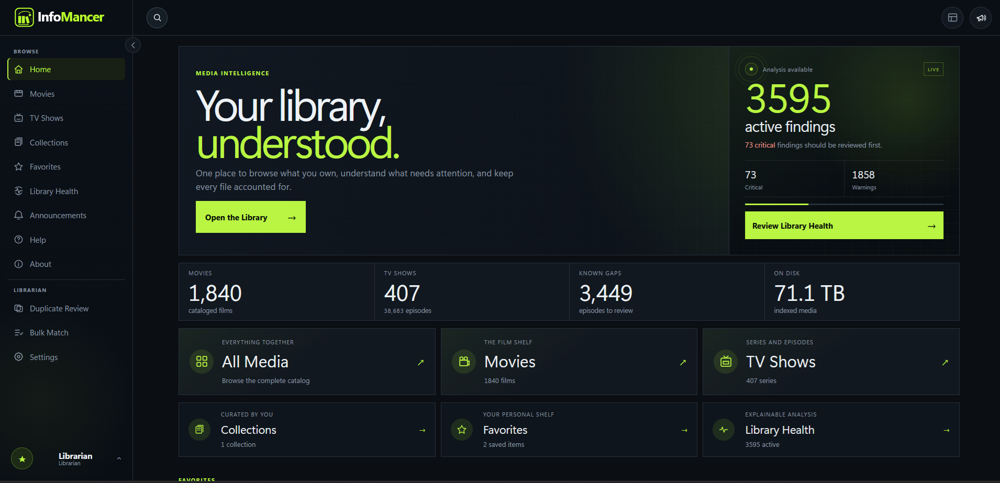

# InfoMancer



InfoMancer is a local-first media catalog, intelligence, review, and safe filesystem-management application for movie and TV libraries spread across multiple disks, NAS shares, and hosts. It scans media into SQLite, enriches titles with provider metadata, inspects technical media characteristics, explains library problems, and lets a Librarian review changes before InfoMancer touches a file.

The current development line is **0.8 alpha**.

## What makes InfoMancer different

InfoMancer is deliberately broader than a file renamer and deliberately safer than an automatic cleanup script.

- **Media Intelligence Engine (MIE):** explainable health, identity, completeness, quality, freshness, and storage findings. MIE records evidence and recommendations instead of hiding decisions behind a single opaque score.
- **Unified Review Workspace:** MIE findings, duplicate decisions, unmatched media, missing episodes, metadata problems, quality decisions, and persisted rename proposals converge into one review domain while specialist workflows remain available when more detail is needed.
- **Safe filesystem automation:** episode/movie/show-folder renames and season-folder organization are preview-first, collision-aware, source-boundary checked, and revalidated immediately before apply.
- **Operation History + guarded Undo:** supported filesystem operations keep a durable before/after record. Undo refuses to run when catalog or filesystem state has drifted rather than guessing.
- **Three file-protection modes:** Read-Only, Standard, and Lockdown let an installation decide how much authority InfoMancer has over media. Read-Only still permits scanning, matching, inspection, MIE, and organization metadata without permitting media-file changes.
- **Duplicate intelligence with managed Trash:** InfoMancer can verify duplicate copies, compare useful quality/storage evidence, recommend which copy deserves attention, move supported duplicates into managed Trash, and restore them through guarded workflows.
- **TV-library depth:** expected-episode data, missing aired episodes, multi-episode awareness, collapsible seasons, and preview-first organization into `Season 01` / `Specials` folders are built into the title workflow.
- **Personal library organization:** Saved Views, pinned views, Favorites, ratings, tags, Collections, Custom Libraries, Smart Collections, custom ordering, and Sort Titles sit alongside the shared physical catalog.
- **Technical media intelligence:** FFprobe-backed runtime, resolution, codec, channel, bitrate, container, and HDR/dynamic-range inspection feeds both title details and MIE quality analysis.
- **Local-first recovery and ownership:** SQLite backups, exports, settings portability, and verified `.infomancer-backup` packages are designed around self-hosted data ownership. Media files are never copied into InfoMancer backups.
- **Native desktop previews:** the 0.8 alpha packages InfoMancer for Windows, macOS, and Linux while preserving Docker as the server/headless installation path.

For the long-form inventory, see **[the complete feature catalog](docs/reference/FEATURE_CATALOG.md)**. The 0.8 Workspace architecture and completed W1-W6 phases are documented in **[docs/WORKSPACE.md](docs/WORKSPACE.md)**.

## Current capability highlights

### Catalog and Workspace

- Multiple Movie and TV roots, including native Windows drive paths and UNC shares when accessible to the process
- Recursive, non-destructive scans of common video formats
- SQLite-backed title and filename search
- Dedicated Library, Movies, TV Shows, Review, Sources, Activity, and Dashboard work domains
- Persistent Library Inspector, contextual selection toolbar, drawers, dialogs, toasts, contextual menus, keyboard shortcuts, and command palette
- Named Saved Views that can be pinned to Library and Dashboard
- Collections, Smart Collections, Custom Libraries, Favorites, personal ratings, tags, custom order, and Sort Titles

### Matching and metadata

- TVDB v4 series and movie matching
- Stored TVDB, TMDB, and IMDb identifiers where available
- IMDb title type, genres, rating, votes, cast, director, and writer data
- Posters/covers and title overviews
- Explicit metadata refresh and Fix Match/Change Match/Unmatch workflows
- Expected-episode import and missing aired regular-episode reporting
- Configurable external search links

### Filesystem and media management

- `SxxExx` and multi-episode `SxxExx-Eyy` parsing
- Episode renames to `Show - S01E01 - Episode Name.ext`
- Show-folder renames using Plex-compatible provider IDs
- Preview-first movie renames
- Preview-first organization into season folders, with season zero mapped to `Specials`
- Persisted global rename proposals in Review
- Original-filename restoration
- Editions, versions, and preferred-version labeling
- Operation History and guarded Undo for supported changes
- Read-Only, Standard, and Lockdown file-protection modes

### Intelligence, health, and duplicates

- Explainable MIE findings across health, identity, completeness, quality, freshness, and storage
- Identity-confidence evidence and conflict explanations
- Library Health remediation guidance
- FFprobe-backed runtime, resolution, video/audio codec, channel, bitrate, container, and HDR inspection
- Source-level quality profiles and title-level technical consistency checks
- Duplicate candidate review and hash verification
- Managed Trash, guarded restore, and storage-recovery recommendations

### Recovery, security, and operations

- Consistent SQLite backups and validated database restore
- Verified portable `.infomancer-backup` creation, preview/verification, and rollback-protected in-app restore
- CSV, JSON, and XML library exports
- Structured event/activity logging and security events
- Local Argon2id authentication, revocable sessions, CSRF protection, invitation/recovery links, throttling/lockouts, and Librarian/Member authorization
- Optional Cloudflare Access JWT validation and account linking
- Non-root Docker runtime, restrictive origin/host/request handling, and security response headers
- Cross-platform test matrix plus dependency and supply-chain checks

## Install

InfoMancer 0.8 alpha has **native desktop preview packages** as well as the Docker server package.

For a personal desktop installation, download the package for your platform from the GitHub release:

- **Windows 10/11 x64:** `InfoMancer_0.8.0-alpha.1_x64-setup.exe`
- **macOS Apple silicon:** `InfoMancer_0.8.0-alpha.1_aarch64.dmg`
- **Linux x86-64:** `InfoMancer_0.8.0-alpha.1_amd64.deb` or `InfoMancer_0.8.0-alpha.1_amd64.AppImage`

The native launcher can either **Run on this computer** with its bundled local InfoMancer core or **Connect to a server** that is already running InfoMancer. Docker is not required for the native desktop app.

Docker remains the recommended path for a headless server, shared household installation, or machine that should run InfoMancer independently of a desktop login. The server/source ZIP contains the Compose files and platform storage examples.

See **[Install InfoMancer](docs/INSTALLATION.md)** for complete native and Docker instructions, platform security warnings, FFprobe requirements, storage examples, updates, backups, and troubleshooting.

On first setup, InfoMancer asks you to create the initial **Librarian** account. Librarians can scan, match, change metadata, review filesystem proposals, perform permitted media operations, and administer users. **Members** can browse and organize permitted personal state without receiving Librarian filesystem or administrative authority.

## Authentication

`INFOMANCER_AUTH_MODE` controls how the application verifies people:

- `local` (default): username or email plus an Argon2id-hashed password.
- `cloudflare`: validates the signed Cloudflare Access JWT on every request, then maps that identity to an InfoMancer account.
- `disabled`: intended only for an explicitly trusted loopback/private installation. It grants the local browser Librarian privileges without a login.

Local sessions use an opaque, `HttpOnly`, same-site cookie; only a SHA-256 hash of the session token is stored in SQLite. State-changing requests require CSRF protection. Public login failures are deliberately generic, and repeated failures are throttled with pair, identity-wide, and IP-wide lockout controls.

In local mode, a Librarian can create a Member or Librarian account and issue a one-time setup link. Setup links expire, are replaced when regenerated, and are stored only as hashes. Password changes and recovery actions revoke affected sessions where appropriate.

If the last Librarian cannot sign in, reset that account from a terminal:

```bash
# Docker Compose
docker compose exec infomancer python -m app.cli reset-librarian USERNAME
```

Or create a one-hour, single-use recovery link:

```bash
docker compose exec infomancer python -m app.cli recovery-link USERNAME \
  --base-url https://your-infomancer-address
```

Treat the printed link like a password. It expires automatically and becomes invalid after use.

Passkeys, application-native MFA, and direct Google/Microsoft/Apple/GitHub adapters are reserved for a later authentication phase. Cloudflare Access can provide external SSO today.

## Safe operating model

InfoMancer treats the filesystem as something to protect, not merely manipulate.

- Scanning never renames, moves, or deletes media.
- Removing a source deletes catalog rows, not media files.
- Rename and season-organization workflows preview destination paths first.
- Existing destinations block the operation rather than being overwritten.
- Persisted rename proposals are revalidated before apply.
- Read-Only Mode blocks media mutation while preserving analysis and catalog workflows.
- Lockdown Mode pauses automatic permanent managed-trash deletion and strengthens irreversible-action protection.
- Operation History records supported filesystem changes and only offers Undo when the current state can be verified safely.
- Search-provider links never start a download.

The service account running InfoMancer needs read permission to catalog files and write permission only for roots where filesystem changes are desired.

## Settings and recovery

Librarian Settings cover installation preferences, metadata/provider status, external search, file-protection mode, fingerprint scheduling, logs, database maintenance, backups, and recovery tooling.

Portable settings exports deliberately omit accounts, passwords, sessions, provider credentials, encryption keys, sources, and media. Database backups contain the SQLite catalog/account state but never media files.

The `.infomancer-backup` recovery package contains a versioned manifest, a consistent SQLite snapshot, collection artwork where present, and SHA-256 verification. The Recovery settings page verifies an uploaded package and shows its source version and contents before any live data is changed. Restore creates and verifies a fresh safety package of the current installation, stages the recovered database and artwork, and rolls them back together if commit fails. Provider credentials, provider-secret encryption keys, movie/TV files, deployment environment files, application binaries, and caches are never restored from the archive. This is also the format produced by the native Windows uninstall recovery flow, so it can be used after a clean reinstall once the same media paths or shares are available.

## Native desktop alpha

The repository contains a Tauri-based native shell with preview packages for Windows, macOS, and Linux. The desktop shell bundles the InfoMancer Python core for standalone use and can also operate as a client for an existing server.

Windows uses an NSIS current-user installer with zero-residue uninstall testing and an optional final recovery backup before local application data is removed. User media is never part of uninstall cleanup.

The Windows updater architecture uses **GitHub Releases** as the distribution host, so InfoMancer does not require a separately hosted update server. Tauri updater signatures are used to verify update artifacts. Production updater signing keys and Windows publisher/AuthentiCode signing remain release gates rather than secrets stored in the repository.

The current macOS alpha is Apple-silicon only and is not yet notarized. The Linux alpha provides DEB and AppImage packages for x86-64 systems. These are preview builds and should be treated as test software while packaging qualification continues.

See **[Packaging](docs/PACKAGING.md)** and **[Updating InfoMancer](docs/UPDATES.md)** for the current architecture.

## Guided setup and onboarding

After the initial Librarian account is created, InfoMancer can walk through installation preferences, metadata-provider setup, Movie/TV source selection, and the first scan handoff. TVDB credentials can be verified inside Guided Setup and are stored outside the SQLite database in protected provider-secret storage.

New users can receive a replayable guided tour of search, navigation, background tasks, announcements, and account controls.

## Announcements

InfoMancer supports bundled official release notices plus local Librarian announcements. Local messages can target Members, Librarians, or everyone and can be one-time, daily, or weekly within their configured schedule. Delivery/read state is tracked per user.

## Isolated sandbox

The sandbox uses a separate database, generated dummy media, container name, Compose project, and loopback port. It does not mount configured production media or production data.

Windows:

```powershell
.\scripts\reset-sandbox.ps1 -Mode Blank
.\scripts\reset-sandbox.ps1 -Mode Sample
```

Linux:

```bash
./scripts/reset-sandbox.sh blank
./scripts/reset-sandbox.sh sample
```

Open `http://127.0.0.1:8788`.

## Command line

InfoMancer includes a cross-platform CLI for status, diagnostics, scans, FFprobe inspection, exports, logs, backups, database optimization, and Librarian recovery.

```bash
python -m app.cli --help
python -m app.cli status
python -m app.cli doctor
```

With Docker, run the same module through `docker compose exec infomancer`.
See **[the command-line guide](docs/CLI.md)** for details.

## Remote access

InfoMancer binds to loopback by default in the recommended deployment. For access away from home, use an authenticated reverse proxy or VPN instead of exposing port 8787 directly. The included Cloudflare overlay can run an outbound-only tunnel beside InfoMancer.

See **[Remote access with Cloudflare](docs/REMOTE_ACCESS.md)** for setup and verification.

## Development and release status

The repository is public, but InfoMancer is still an alpha project and no final open-source license has been selected yet. Do not treat an alpha build as a guarantee that database migrations, packaging, or interfaces have reached long-term compatibility.

Current release work includes production updater/code signing, large-library performance qualification, filesystem/data-durability torture testing, accessibility/responsive QA, clean reinstall/recovery qualification, and final licensing/privacy/provider review.

See **[the 0.8 release gate](docs/RELEASE_REVIEW.md)** and **[qualification matrix](docs/QA_0_8.md)**.

## Tests

```powershell
python -m unittest discover -s tests -v
```

The permanent CI matrix also runs Python validation on Ubuntu, macOS, and Windows plus dependency/supply-chain checks.

## Intentional boundaries

InfoMancer does not scrape torrent-result pages, automatically acquire copyrighted media, or submit downloads to a client. External search links are convenience links only. Use InfoMancer only with media and metadata sources you are legally entitled to access.
