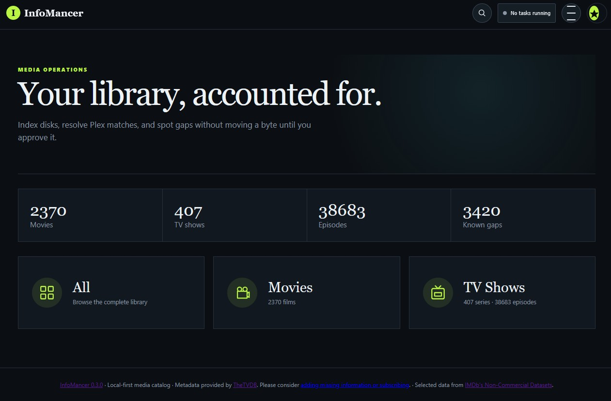

# InfoMancer
# InfoMancer

A local-first, lightweight movie and TV inventory for multiple disks. InfoMancer scans media into SQLite, helps match titles through TVDB and IMDb metadata, reports missing episodes, and previews Plex-compatible filesystem changes before applying them.

## What works

- Multiple movie and TV roots, including Windows drive paths and UNC shares when run natively
- Recursive, non-destructive scans of common video formats
- Fast SQLite-backed title and filename search
- `SxxExx` and multi-episode `SxxExx-Eyy` parsing
- TVDB v4 series and movie matching with expected-episode import
- IMDb genres, title type, ratings, vote counts, posters, and metadata filters
- Missing aired regular-episode reports with configurable external search links
- Reviewable bulk matching and rename workflows
- Show-folder renames to `Show (Start - End) {tvdb-12345}`
- Episode renames to `Show - S01E01 - Episode Name.ext`
- Targeted series rescans, original-filename restoration, and match removal
- Persistent background-task status and a new-media intake queue
- Local user accounts with Argon2id passwords, revocable sessions, and CSRF protection
- Fixed Librarian and Member roles with Librarian-managed user access
- Optional Cloudflare Access identity validation and account linking
- Librarian-only application settings with validation and change history
- Replayable new-user walkthroughs and per-user tour completion
- Official release announcements plus scheduled Librarian messages for Members
- Loopback-only Docker deployment suitable for an existing Cloudflare Tunnel

Plex recommends a year in TV show names, `Season XX` folders, and provider IDs in the exact curly-brace form `{tvdb-123456}`. InfoMancer follows that provider-ID format. It does not yet reorganize files into season folders.

## Install

Docker is the recommended installation on Windows, macOS, and Linux. It keeps
InfoMancer and FFprobe consistent while allowing each operating system to map
its own disks, mounted volumes, and network shares beneath `/media` inside the
container.

See **[Install InfoMancer](docs/INSTALLATION.md)** for the complete
platform-specific walkthrough, storage examples, updates, backups, and
troubleshooting.

The short version is:

1. Install Docker Desktop, or Docker Engine with Compose on Linux.
2. Copy `.env.example` to `.env`.
3. Copy the matching example from `deploy/` to `compose.media.yaml` and replace
   its example media paths.
4. Run:

   ```bash
   docker compose -f compose.yaml -f compose.media.yaml up -d --build
   ```

5. Open `http://127.0.0.1:8787` and follow Guided Setup.

On the first visit, InfoMancer asks you to create the initial **Librarian** account. Librarians can scan, match, change metadata, rename files, and administer users. **Members** can browse and search without filesystem or administrative access.

## Authentication

`INFOMANCER_AUTH_MODE` controls how the app verifies people:

- `local` (default): username or email plus an Argon2id-hashed password.
- `cloudflare`: validates the signed Cloudflare Access JWT on every request, then maps that identity to an InfoMancer account. A Librarian must pre-create later users with the exact verified email address.
- `disabled`: intended only for an explicitly trusted loopback/private installation. It grants the browser Librarian privileges without a login.

Local sessions use an opaque, `HttpOnly`, same-site cookie; only a SHA-256 hash of the session token is stored in SQLite. State-changing requests require a per-session CSRF token. Account settings provide Profile, Password, and Sessions pages, while Librarians also receive a Users page.

In local mode, a Librarian creates a Member or Librarian account and gives that person a one-time setup link. The full link is shown only once, expires after 24 hours, and is replaced whenever a new link is generated. Only a SHA-256 hash of its secret is stored in SQLite. The invited person chooses their own password; using the link immediately invalidates it. Share these links privately because possession of an unused link grants access to that account.

If the last Librarian cannot sign in, reset that account from a terminal. The command asks for the new temporary password interactively, signs out its existing sessions, and requires another password change after sign-in:

```bash
# Docker Compose
docker compose exec infomancer python -m app.cli reset-librarian USERNAME

```

For a native installation, run `.venv\Scripts\python.exe -m app.cli reset-librarian USERNAME` on Windows or `.venv/bin/python -m app.cli reset-librarian USERNAME` on macOS/Linux. The recovery command accepts Librarian usernames only and never places the new password in shell history.

Members can browse and search titles, metadata, missing episodes, and permitted external provider links. Only Librarians can manage sources and users, scan or match media, refresh metadata, or perform filesystem changes. These permissions are enforced by the server; the Member interface also omits controls they cannot use.

Passkeys, MFA, and direct Google, Microsoft, Apple, and GitHub adapters are reserved for a later authentication phase; the provider-neutral identity table is already in place.

The service account running InfoMancer needs read permission to catalog files and write permission only for roots where renaming is desired.

## App Settings

Librarians can open **Settings** from the main menu or their account menu. Settings are split into four sections:

- **General** changes the installation name, display time zone, default library view, and default cover size.
- **Metadata & Matching** shows TVDB credential status, tests the TVDB connection, reports locally stored IMDb coverage, and starts an IMDb metadata update.
- **External Search** changes the provider label and URL template used by series, episode, and missing-episode search actions.
- **System** reports application and database health, inspects technical media
  information, exports the catalog and logs, controls logging detail, provides
  database optimization and restart controls, and lists recent settings
  changes with the Librarian who made each change.

Safe presentation and provider preferences are stored in SQLite and take effect on subsequent page loads. TVDB credentials entered through InfoMancer are stored in a separate encrypted application-data file; `INFOMANCER_SECRET` protects that file when configured, otherwise InfoMancer creates a restricted local encryption key in its data folder. Other trust-boundary settings—including authentication mode, secure-cookie policy, Cloudflare validation, database location, and allowed browse roots—remain protected environment or Compose configuration.

## Tours and announcements

New local-account users receive a short guided tour after their first sign-in. The tour introduces global search, navigation, background tasks, announcements, and account controls. A user can skip it without losing access to it: **Profile → Take the tour again** replays the walkthrough at any time.

The **Announcements** page is available to every signed-in user from the main menu. Official release notes are bundled with InfoMancer versions and appear once for each user. Librarians can also publish plain-text installation messages for Members, Librarians, or everyone. A message may appear once or repeat daily or weekly through a required end date. Delivery receipts are stored per user, so reading a notice does not mark it as read for anyone else.

Librarian announcements are intentionally local to that InfoMancer installation. Official notices are delivered through application updates rather than a remotely writable announcement service; this keeps self-hosted installations independent and avoids adding another external trust dependency.

## Guided setup

After the first Librarian finishes or skips the welcome tour on an empty installation,
InfoMancer offers Guided setup or Manual setup. Guided setup saves progress across
installation preferences, metadata status, Movie and TV source selection, and the
first scan handoff. Manual setup opens Home, where an empty-library card keeps Add
first source and Setup Assistant actions available. Librarians can reopen Setup
Assistant later from Help, App Settings, or the Profile menu.

Guided Setup explains how to obtain TVDB credentials, verifies them before moving
forward, and saves them encrypted without leaving the wizard. The source step embeds
the same folder browser and media preview used by Source Management, and requires at
least one Movie or TV Shows folder before setup can finish. The isolated sandbox has
a clearly labeled testing-only bypass for metadata-provider setup.

## Isolated sandbox

The sandbox uses a separate database, generated dummy media, container name,
Compose project, and loopback port. It never mounts configured production
media or production data.

On Windows with Docker available:

```powershell
.\scripts\reset-sandbox.ps1 -Mode Blank
.\scripts\reset-sandbox.ps1 -Mode Sample
```

On Linux:

```bash
./scripts/reset-sandbox.sh blank
./scripts/reset-sandbox.sh sample
```

Open `http://127.0.0.1:8788`. Blank presents the complete first-run experience.
Sample creates and scans disposable fixtures; sign in with username `sandbox` and
password `sandbox librarian password`. Both reset modes delete only
`data-sandbox/` and `sandbox-media/` inside the repository.

## Packaging and release readiness

Docker Compose is the first public-beta delivery target. Signed Windows MSI,
macOS DMG, and native Linux packages are feasible, but require an application
launcher, platform data locations, service/update behavior, FFprobe packaging,
code signing, and clean-machine installer testing.

See the **[cross-platform packaging plan](docs/PACKAGING.md)** and
**[release review checklist](docs/RELEASE_REVIEW.md)**.

## Command line

InfoMancer includes a cross-platform CLI for headless status checks,
diagnostics, source scans, FFprobe media inspection, CSV/JSON/XML exports,
live log viewing, database backups, optimization, and Librarian recovery.

```bash
python -m app.cli --help
python -m app.cli status
python -m app.cli doctor
```

With Docker, run the same module through `docker compose exec infomancer`.
See the **[command-line guide](docs/CLI.md)** for commands, safe automation,
and examples.

## Remote access

InfoMancer binds to loopback by default. For access away from home, use an
authenticated reverse proxy or VPN without exposing port 8787 directly. The
included Cloudflare overlay can run an outbound-only tunnel beside InfoMancer.

See [Remote access with Cloudflare](docs/REMOTE_ACCESS.md) for setup, verification, and rollback. Do not activate the public hostname without the Access policy: the application deliberately relies on that authenticated proxy as its security boundary.

## GitHub

The repository excludes local secrets and databases and includes a secret-free GitHub Actions test workflow. A private repository is recommended first; no license has been selected yet. See [Moving InfoMancer to GitHub](docs/GITHUB.md) for private, public, and future deployment options.

## Safe operating model

- Scanning never renames, moves, or deletes media.
- Removing a root deletes catalog rows only.
- Every filesystem rename has a review step showing old and new paths.
- A rename refuses to overwrite an existing destination.
- Search-provider links do not initiate downloads. Use them only for media you are legally allowed to obtain.
- Back up the SQLite file and test renames on a small sample library first.

## Tests

```powershell
python -m unittest discover -s tests -v
```

## Current boundaries

InfoMancer does not scrape torrent result pages, submit downloads to a client, or reorganize season directories. Direct social sign-in, passkeys, and MFA are not yet enabled; Cloudflare Access can currently provide external SSO.

Season-zero specials and episodes with future air dates are excluded from the default gap report. TVDB items without an air date are included.
